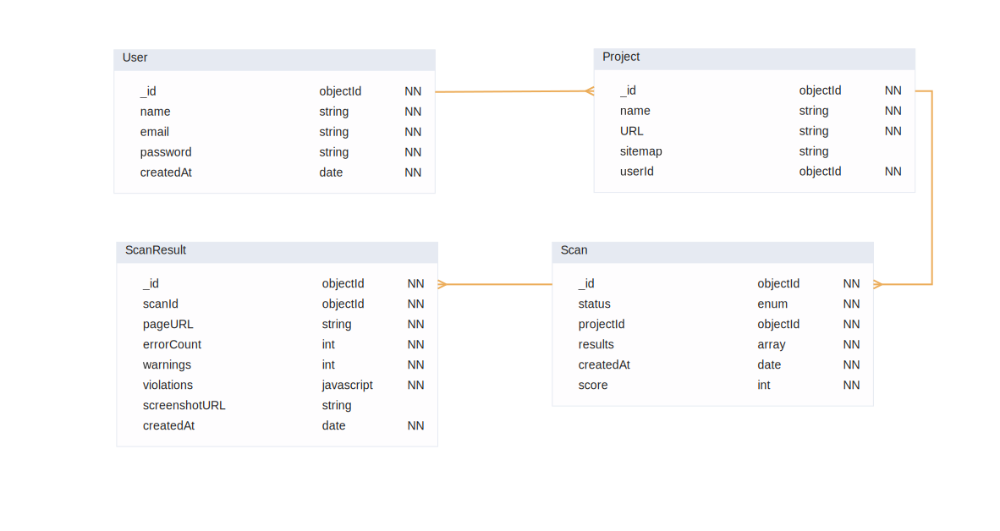

# A11y Sentinel 🛡️ -- ( 🚧🚧 Under Construction 🚧🚧 )

**A11y Sentinel** is an automated backend application that empowers development teams to monitor, track, and resolve web accessibility (WCAG) issues across their entire website, not just single pages. Move beyond manual checks to continuous, automated compliance auditing.

## Features:

- **Site-Wide Scans**: Automatically crawls your website using sitemaps or `robots.txt` to ensure complete coverage.
- **Blazing Fast Scans**: Powered by a distributed **Redis-backed job queue** for asynchronous processing.
- **Actionable Reports**: Drill down into individual pages to see specific errors, their impact, and the elements affected.
- **axe-core Powered**: Utilizes the industry-standard `axe-core` engine for the most reliable accessibility analysis.

## Tech Stack

- **Backend**: Node.js, Express, JavaScript
- **Database**: MongoDB with Prisma ORM
- **Job Queue & Caching**: Redis, BullMQ
- **Browser Automation**: Playwright
- **Accessibility Engine**: axe-core
- **Deployment**: Railway (Backend, DB, Redis)
- **Auth**: JWT, HTTPOnly Cookie

## Database Schema

The application uses a MongoDB database with a schema designed for efficient querying of scan results and project management. The core models are structured as follows:



## Implementation decisions

First is the Crawling logic decision I have made. It follows the graph attached below for best performance in searching for URLs on pages:


## Getting Started

### Prerequisites

- Node.js (v18 or higher)
- MongoDB database
- Redis instance

### Installation

1.  **Clone the repository**

    ```bash
    git clone https://github.com/Amer-Mekic/A11y-Sentinel.git
    cd A11y-Sentinel
    ```

2.  **Install dependencies**

    ```bash
    # Install root dependencies
    npm install
    ```

3.  **Set up environment variables**
    Create a `.env` file in the root directory and configure the following variables:

    ```env
    # Database
    DATABASE_URL="your_mongodb_connection_string"

    # Auth
    JWT_SECRET="your_jwt_secret"

    # Redis (for BullMQ)
    REDIS_URL="your_redis_connection_string"
    ```

4.  **Set up the database**

    ```bash
    # Generate the Prisma Client and push the schema to your DB
    npx prisma generate
    npx prisma db push
    ```

5.  **Run the development servers**

    ```bash
    # Run the backend (Server)
    npm run dev:server

    # Run the bullmq process (Server)
    npm run dev:worker
    ```
    Send requests using Postman

## Project Roadmap

- [ ] **Email Reports**: Automated weekly digest emails with scan summaries.
- [ ] **PDF Export**: Generate and download PDF reports.
- [ ] **Integration Hooks**: Automate scans via GitHub Actions
- [ ] **Cross-Browser Testing**: Run scans using Playwright's Firefox and WebKit engines.

## Acknowledgments

- The [axe-core](https://github.com/dequelabs/axe-core) team for the accessibility engine.
- The [Playwright](https://playwright.dev/) team for the automation tool.